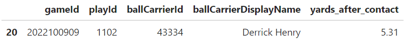
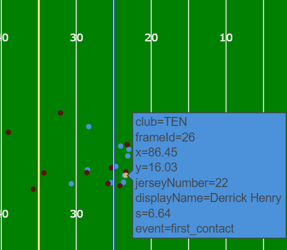
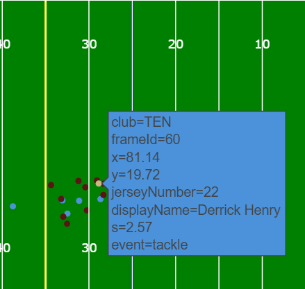
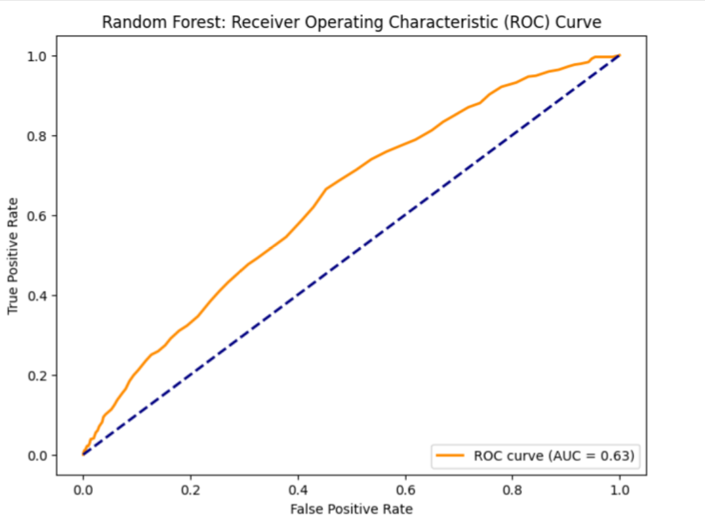
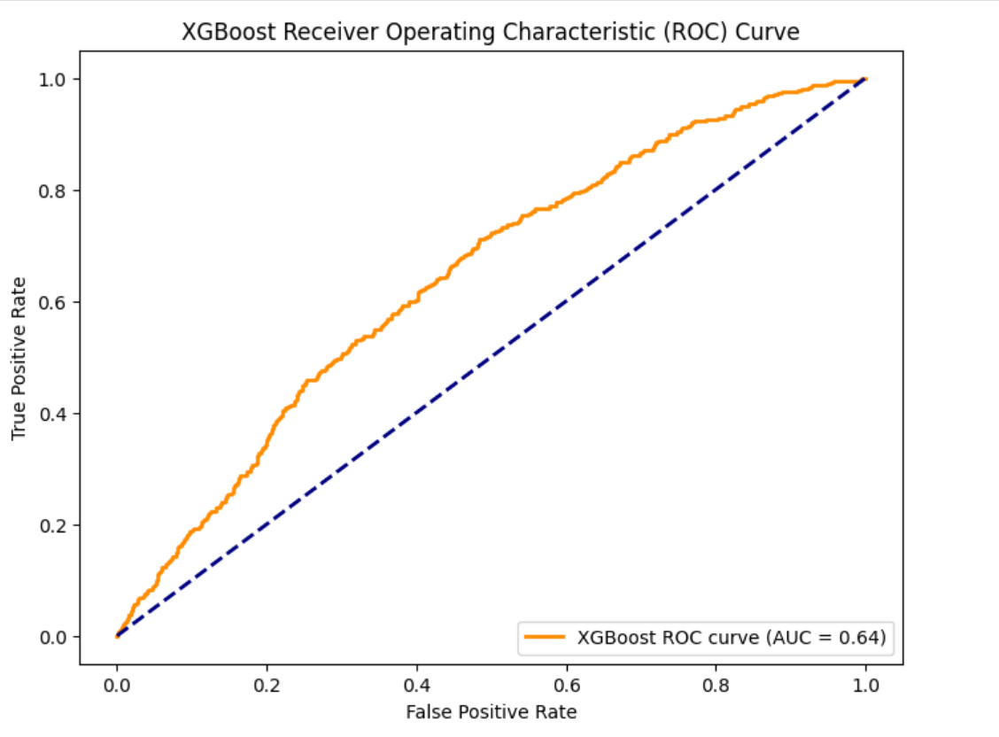
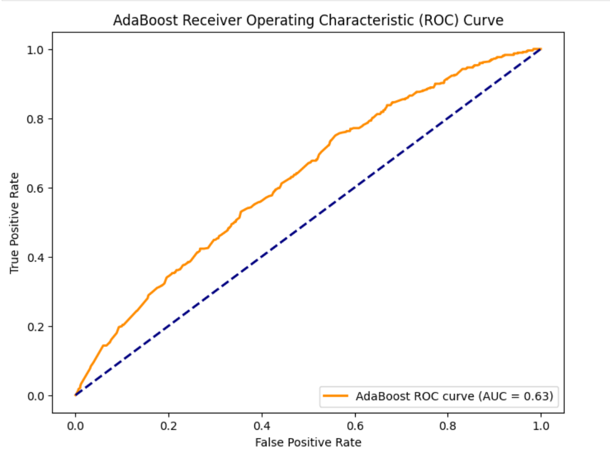

# NFL Big Data Bowl 2024 Repository

Welcome to the repository for the NFL Big Data Bowl 2024, where we delve into the intricacies of tackling performance, particularly focusing on yards after contact in pass plays. This project is part of the Kaggle competition, aiming to extract valuable insights from the extensive NFL tracking data.

## Overview

The primary objective of this project is to analyze and model the factors influencing yards gained after contact during pass plays. Leveraging the rich dataset provided by the NFL, we explore various features such as player speeds, distances, and physical attributes to gain a comprehensive understanding of tackling dynamics.

## Key Features

- **Data Exploration:** I embarked on my journey by delving into the wealth of NFL dataframes at our disposal, meticulously dissecting their diverse structures to unearth crucial variables and discern patterns that might exert influence on yards after contact. While each dataframe offered its unique insights, it was our tracking dataframe that emerged as the treasure trove of invaluable information. Visit the [YAC EDA.ipynb](https://github.com/quincy928/BDB-2024/blob/main/YAC%20EDA.ipynb) to better understand the dataframes. This dynamic resource furnished us with real-time player positions, angles, and velocities on the field, providing a comprehensive snapshot of gameplay. However, to paint a complete picture, we needed to supplement this with pertinent attributes sourced from our supporting dataframes. Extracting details such as ballcarrier identification, yards to first down, and player biometrics including heights and weights from these auxiliary sources, we ensured a comprehensive understanding to fuel our analysis.

- **Data Preprocessing:** Considerable resources were allocated to meticulously clean and refine the dataset. Our efforts encompassed a range of tasks, including play categorization, key player identification, and the creation of pertinent features. These features, which included metrics such as average speed before contact, the distance between the ballcarrier and the defender at the moment of ball reception, and the angle disparities between players at initial contact, were pivotal in our analysis. Notably, I also engineered the dependent variable, yards after contact, in hopes to predict broken tackles. Check out the following play in which Derrick Henry gains 5.31 yards after initial contact. For further exploration of this play, check out the file in the [html folder](https://github.com/quincy928/BDB-2024/tree/main/html), or play around with the `plot_football_play` function in the [Modeling.ipynb file](https://github.com/quincy928/BDB-2024/blob/main/Modeling.ipynb).

 

  To streamline this process, I developed custom functions housed within the [FeatureEngineering.py](https://github.com/quincy928/BDB-2024/blob/main/YAC%20EDA.ipynb) file. These functions were designed to compute these features for each play from our tracking dataframe. Subsequently, the calculated features were integrated into our newly formed 'yac_df' dataframe, which served as the foundation for our modeling endeavors.

- **Modeling:** I experimented with a number of models, both for regression and classification. In the majority of plays, yards after contact was fewer than 3 yards, making it very difficult for a regression model to accurately predict the number of yards gained on a broken tackle. Additionally, the goal here was to identify the first broken tackle, and not subsequent ones. I found it more useful to reframe the problem into a classification setting: did the ballcarrier gain 3 or more yards after initial contact.

  I employed random forest, xgboost, adaboost, and even experimented with a rudimentary feedforward neural network. I found the xgboost model to have slightly better performance than the other models, though they were all only around 70% accurate with an AUC score of 0.60-0.65.
  
  

## Project Structure

- **Notebooks:** The repository includes Jupyter notebooks detailing the step-by-step process of data exploration, preprocessing, modeling, and feature analysis.

- **Data:** The 'data' directory contains the raw and processed datasets used throughout the project. Note that the tracking data files were too large and can instead be found [here](https://www.kaggle.com/competitions/nfl-big-data-bowl-2024/data)

- **Animation:** This section houses the function for animating plays from the tracking data
